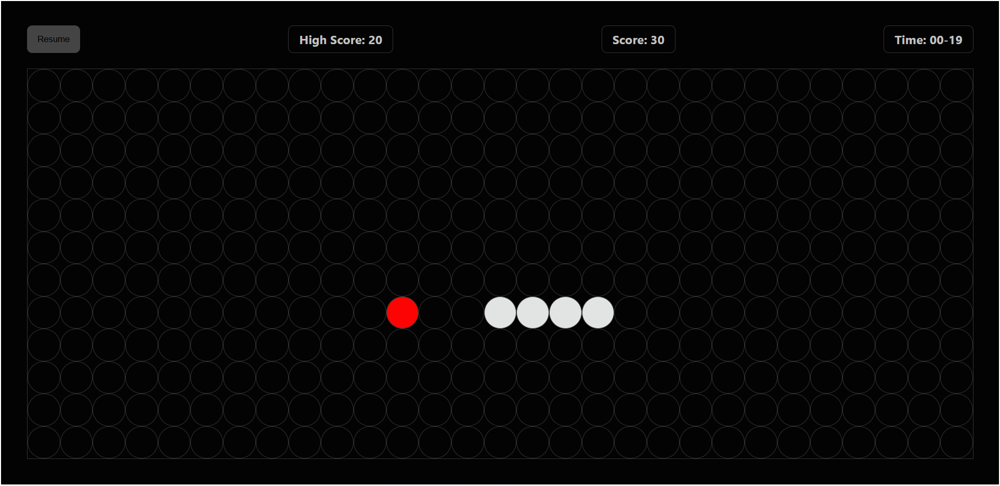
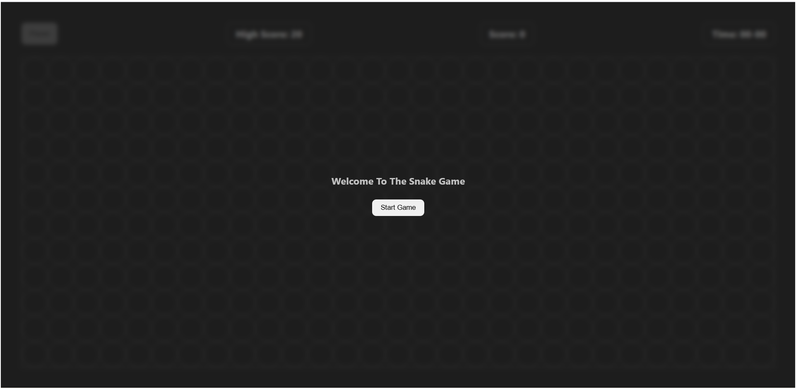

# Snake Game

## Description
A fun and interactive Snake Game built using HTML, CSS, and JavaScript.  
Features include:
- Score tracking with high score stored in localStorage
- Timer
- Pause/Resume functionality
- Fully responsive design for desktop screens

## Screenshot / GIF

## Live Demo
Play the game live here:  
[Snake Game Live](https://bablubhatt.github.io/Snake-Game/)

## Tech Stack
- HTML
- CSS
- JavaScript

Step 2. Open index.html in your browser to play the game.
Features --
1). Arrow keys to move the snake
2). Food collection increases score
3). High score tracking
4). Timer
5). Pause/Resume button
